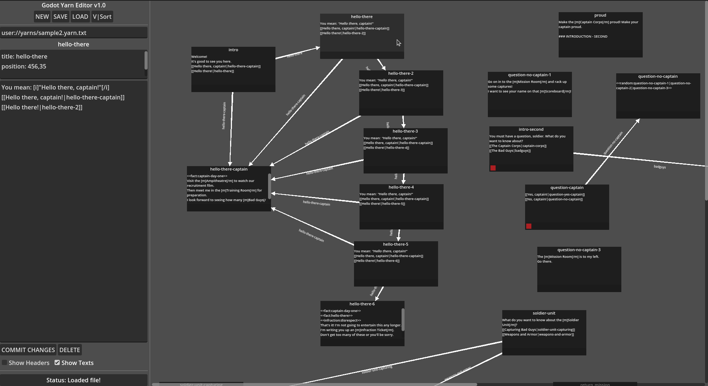

# Godot Yarn Editor v1.0
A viewer/editor for Yarn text files.

  

Built in Godot 4.3

## Purpose

Can't seem to find just a basic Yarn editor that isn't in a browser..
And also works with my yarn custom mods...
As text-edited yarn files get larger and larger, the need for visualization also grows...

A visualizer that can see broken/dead end paths, etc,
while also keeping support for text-friendly manual editing (writing) at the forefront.

Viewing Yarn files is the focus of this editor, creating + editing them is secondary.
It will still be recommended to do most of that by hand, and using this app for visual overviews and tweaking.
Saving your yarn files with this may add unwanted cruft. Backup your files before overwriting them!

## Tree Sorting

Currently a vertical auto-sort of trees, loops, and stranded solo sections exists.
It's not perfect but it's decent and can quickly help identify any issues with your branches.
For the future, adding additional algorithms for better arrangements, or alternate arrangements, may be added.

## Godot

This is not be meant as an addon for Godot, just a stand-alone yarn editing app.

Godot is just the framework for the app, but in the future, turning it into addon should be easy if warranted.

Currently uses Godot 4.3dev5, was supposed to be 4.2 but accidentally was opened in 4.3 and now 4.2 can't open yarn_box.tscn.

## Credits

Addons / Libraries:
- Eranot Resizable Addon [https://github.com/Eranot/godot-resizable]
- Godot Yarn Importer [https://github.com/naturally-intelligent/godot-yarn-importer]

